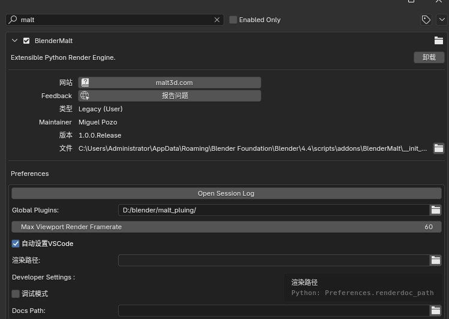

# Malt插件和自定义节点

## 插件
Malt主要是通过插件添加自定义节点的

- 从[github](https://github.com/bnpr/Malt/tree/Development/plugins/PluginExample)下载示例插件`PluginExample`

- 新建一个`Malt_Plugin`文件夹，将示例插件`PluginExample`文件放到里面

<figure style="text-align: center;">
  
</figure>

- 打开Malt,在插件设置中添加插件路径,如图所示

!!! warning "注意"
    输入的路径应该是`PluginExample`所在的上一级目录`Malt_Plugin`，不要把`PluginExample`也加到路径里去了


<figure style="text-align: center;">
  
</figure>
- 保存插件设置，重启blender (1) ,现在你应该可以在节点添加菜单中看到新的节点
    { .annotate }

    1.  或者使用渲染管线旁的刷新按钮

!!! warning "注意"
    如果插件中添加了新的文件，需要重启渲染器才能读取

## 自定义节点

将`PluginExample`复制一份，修改一下文件夹名字如`MyPlugin`

打开文件夹中的`__init__.py`，这个文件,修改为:

```py title="__init__.py" linenums="1"
import os
from Malt.PipelinePlugin import PipelinePlugin, isinstance_str

class MyShader(PipelinePlugin):

    @classmethod
    def poll_pipeline(self, pipeline):
        return isinstance_str(pipeline, "NPR_Pipeline")

    @classmethod
    def register_graph_libraries(self, graphs):
        library_path = os.path.join(os.path.dirname(__file__), "Shaders")
        for graph in graphs.values():
            if graph.language == "GLSL":
                graph.add_library(library_path)
PLUGIN = MyShader
```
主要就是改了一下类名，这个文件的作用就是把插件里`Shaders`文件夹里的glsl文件添加到渲染管线中

在Shaders文件夹下新建一个`my_shader.glsl`文件，删掉原本的`PluginExample.glsl`

添加以下代码:

```GLSL title="my_shader.glsl" linenums="1"
/* META
@edge0: subtype=Slider;default=0.0;min=0.0;max=1.0;
@edge1: subtype=Slider;default=1.0;min=0.0;max=1.0;
*/
void my_smoothstep( in float x,in float edge0, in float edge1, out float result) {
    result = clamp((x - edge0) / (edge1 - edge0), 0.0, 1.0);
    result = result * result * (3.0 - 2.0 * result);
}

```

按下ctrl+S(1)保存文件后你的blender应该会卡一下,然后你应该就能看到新加的节点
{ .annotate }

1.  第一次需要重启渲染器

<figure style="text-align: center;">
  
  <figcaption><small>自定义的节点<small></figcaption>
</figure>
因为Malt没有自带SmoothStep这个节点，所以我们自己做一个
    ```GLSL linenums="1"
    /* META
    @edge0: subtype=Slider;default=0.0;min=0.0;max=1.0;
    @edge1: subtype=Slider;default=1.0;min=0.0;max=1.0;
    */
    ```
META表示元信息，主要用来定义接口的默认值，最大值最小值等

!!! warning "注意"
    META 部分的格式一定要写正确，有错误的话虽然能看到节点，但是可能会有稀奇古怪的问题

    如果出现奇怪的问题可以删掉META再测试一下

函数一般使用`in`和`out`关键字定义输入输出接口，返回空`void`

如果只有一个返回值也可以直接返回
```GLSL  linenums="1"
float my_smoothstep(float x,float edge0, float edge1) {
    float result;
    result = clamp((x - edge0) / (edge1 - edge0), 0.0, 1.0);
    result = result * result * (3.0 - 2.0 * result);
    return result;
}
```

至于这个SmoothStep函数要怎么写,直接网上毛一个过来就行了，或者叫ai写一个

## override覆盖参数

如果想让使用同一个Shader的材质,拥有不同的参数效果该怎么办,就要需要用到参数覆盖了

点击任意一个节点,可以看到`N面板`的`节点选项卡`中的属性右边有一个小眼睛的图标

打开眼睛图标的参数就会在材质面板显示出来,在材质面板中勾选属性右边的`√`,就可以为每一个材质单独设置参数

像是贴图参数等每个材质都不一样,就可以显示在材质面板中

<figure style="text-align: center;">
  
  <figcaption><small>自定义的节点<small></figcaption>
</figure>

## 数据类型

Malt节点中不同的数据类型会自动隐式转换

详细参考[Malt数据类型](https://malt3d.com/Documentation/Graphs/#socket-types)

- 布尔型：`bool`
- 浮点型：`float`
- 整数型：`int`
- 无符号整数型：`uint`
- 二维向量：`vec2`
- 三维向量：`vec3`
- 四维向量：`vec4`
- 布尔矢量：`bvec(n)`
- 整数矢量：`ivec(n)`
- 无符号整数矢量：`uvec(n)`
- 4*4矩阵`mat4`
- 一维纹理`sampler1D`
- 二维纹理`sampler2D`
- 包含int值的(n)纹理`isampler(n)D`
- 包含uint值的(n)纹理`usampler(n)D`
- 结构体：`struct`
- 数组：`array(size)`

## 其他

内置节点的GLSL在
`插件文件夹\BlenderMalt\.MaltPath\Malt\Shaders`下

内置的变量可以查看`插件文件夹\BlenderMalt\.MaltPath\Malt\Shaders\Node Utils 2\Input.glsl`文件，里面有一些关键字可以使用

比如`POSITION`,`NORMAL`,`view_direction()`等，可以直接在函数中使用，也可以在META中设置为默认值：

```GLSL linenums="1"
/* META
@position: default=POSITION;
@normal: default=NORMAL;
@view_direction: default=view_direction();
*/
void example(in vec3 position, in vec3 normal, in vec3 view_direction, out vec4 color)
{
    color = vec4(position, 1.0);
}
```

<figure style="text-align: center;">
  
  <figcaption><small>这里可以显示隐藏的节点<small></figcaption>
</figure>

## 其他插件
[制作法向外扩描边的插件](https://github.com/bnpr/Malt/discussions/558)

[透明层插件](https://github.com/bnpr/Malt/tree/Development/plugins/Experimental)