# 贴图构成及光影

这个章节里将创建基本的光影效果,并且简单介绍一下鸣潮里的贴图构成

!!! danger "注意"
    贴图类型及用法存在大量主观推测,可能非实际用法,仅供参考

## 贴图

<figure style="text-align: center;">
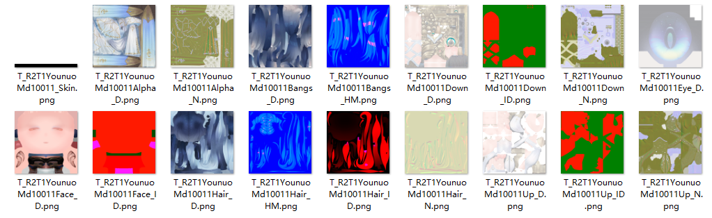
<figcaption><small>贴图构成<small></figcaption>
</figure>

鸣潮中一个角色包含5种类型的贴图:

### _D后缀

<div style="display: flex; justify-content: center; align-items: flex-start; gap: 10px;">
  <figure style="text-align: center;">
    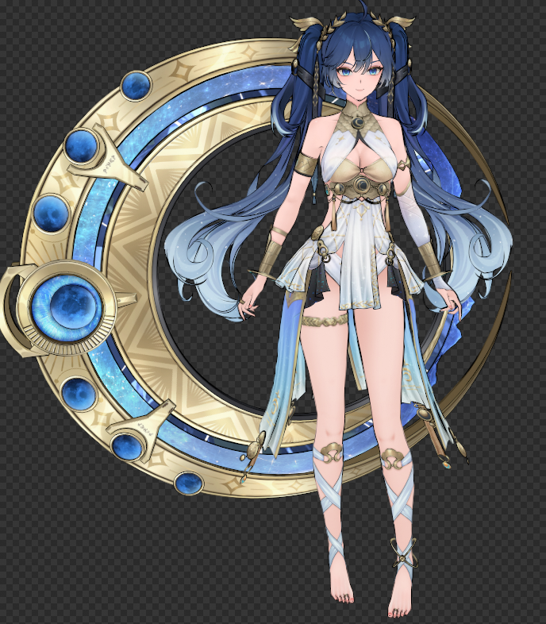
<figcaption><small>基础色<small></figcaption>
  </figure>
  <figure style="text-align: center;">
    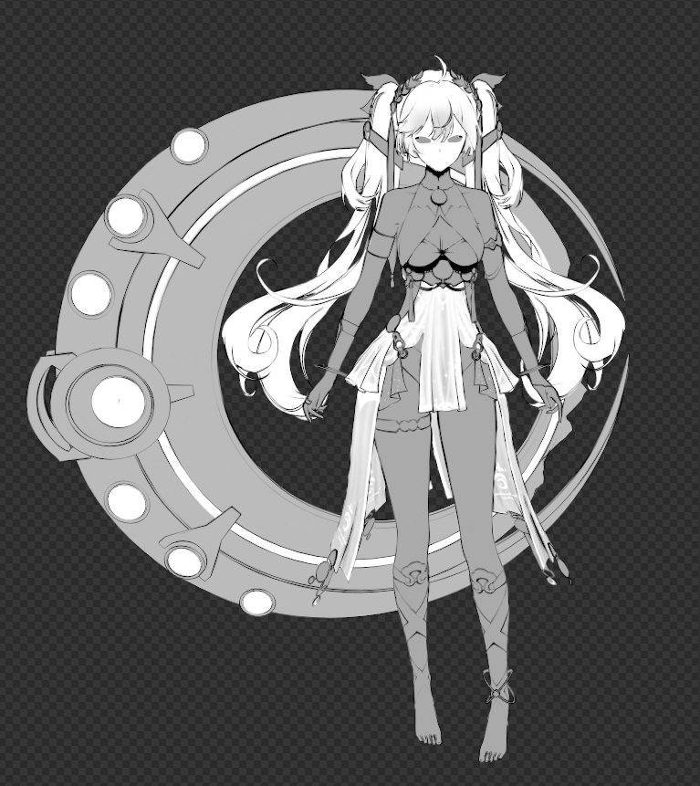
<figcaption><small>Alpha通道<small></figcaption>
  </figure>
</div>

_D后缀的贴图记录了`基础色`,`透明度`以及`固定阴影`,其中的`Alpha`通道分为两种情况

- 如果是透明物体,则表示透明度
- 如果是不透明物体,则表示永远为阴影的部分的固有阴影

### _N后缀
<figure style="text-align: center;">
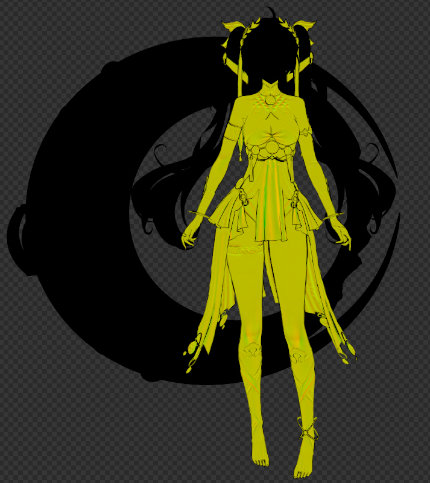
<figcaption><small>R,G 法线<small></figcaption>
</figure>
<div style="display: flex; justify-content: center; align-items: flex-start; gap: 10px;">
  <figure style="text-align: center;">
    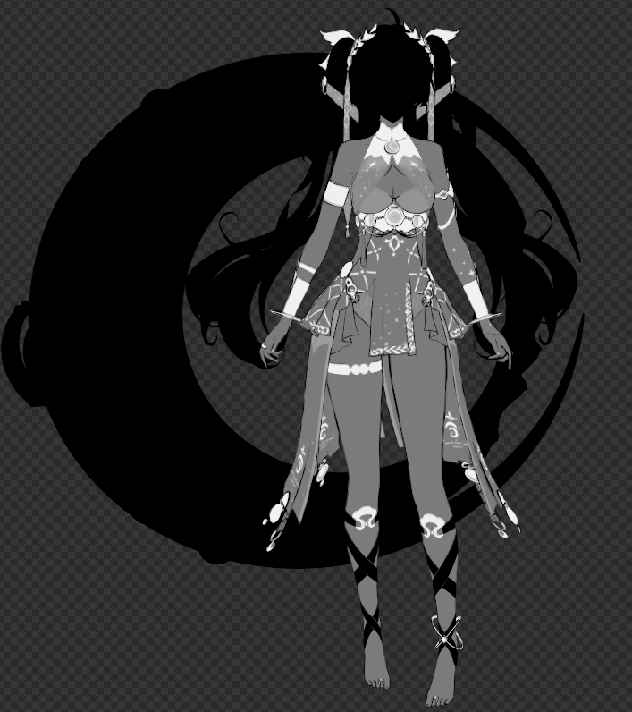
<figcaption><small>B 金属度<small></figcaption>
  </figure>
  <figure style="text-align: center;">
    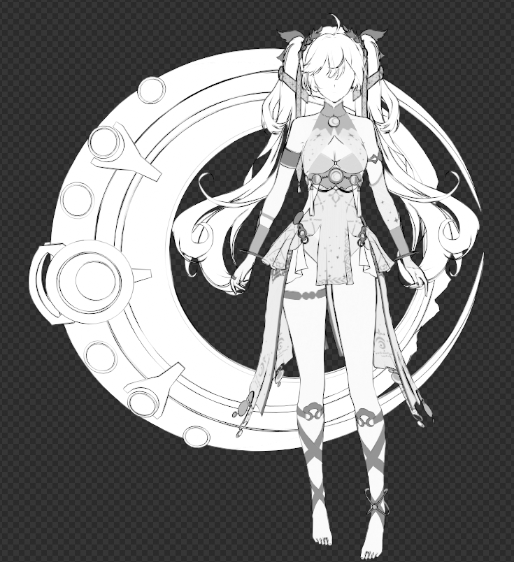
<figcaption><small>A 粗糙度<small></figcaption>
  </figure>
</div>
_D后缀的贴图记录了`法线`,`金属度`,`粗糙度`

- R,G通道记录了法线信息
- B通道记录了金属度信息
- A通道记录了粗糙度信息

!!! note "绿色法线的使用方法"
    法向是一个单位向量，利用长度为1可以还原出原本的法线
    ```
    normal = vec3(xy.x, xy.y, sqrt(1-clamp(dot(xy, xy),0.,1.)))*0.5+0.5;
    ```
    需要注意的是,计算Z通道时需要先将R,G通道的数值转换成-1到1的区间

### _ID后缀

<figure style="text-align: center;">
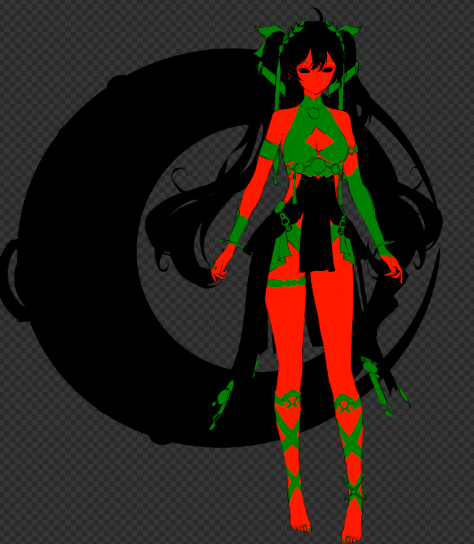
<figcaption><small>ID贴图<small></figcaption>
</figure>

没啥好说的,就是一个ID贴图,用来抠出不同的部位

### _HM后缀

<div style="display: flex; justify-content: center; align-items: flex-start; gap: 10px;">
  <figure style="text-align: center;">
    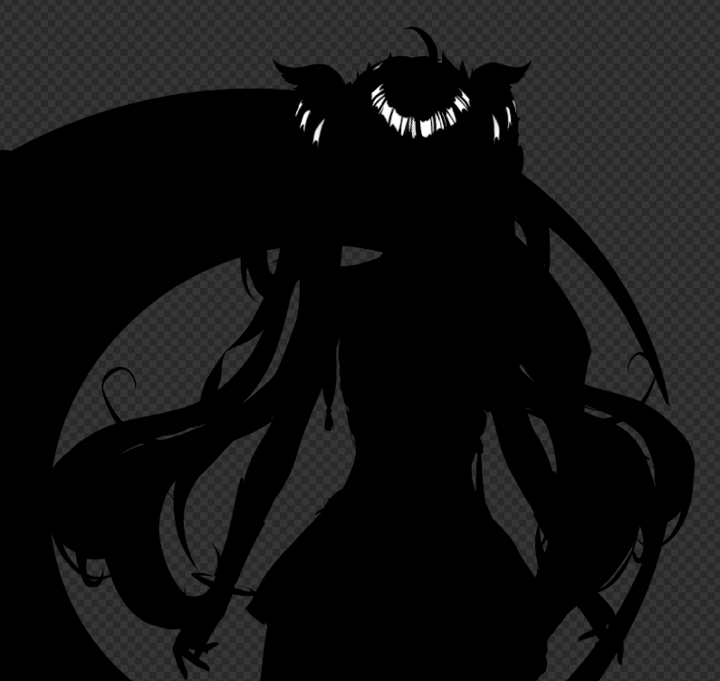
<figcaption><small>R 高光<small></figcaption>
  </figure>
  <figure style="text-align: center;">
    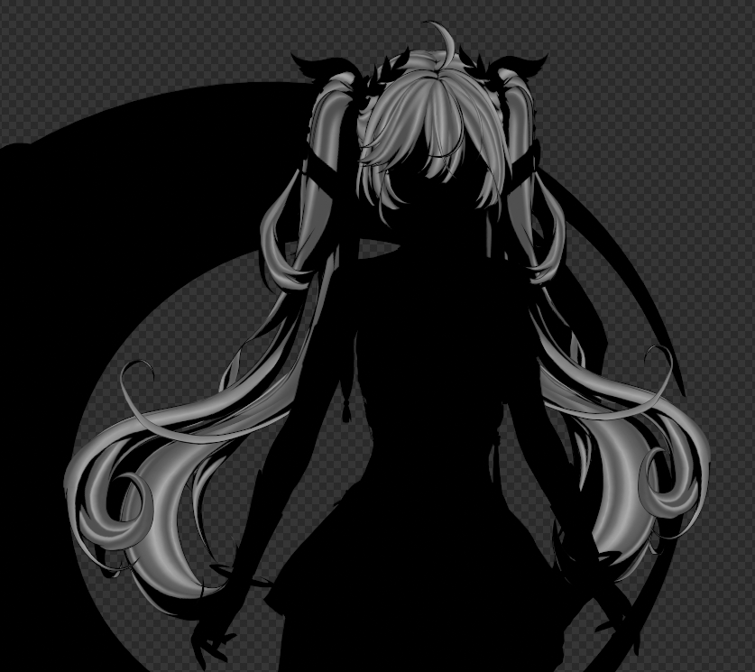
<figcaption><small>G通道<small></figcaption>
  </figure>
</div>

_HM后缀的贴图是头发专属的贴图,R通道是`高光`,G通道看着像头发的`阴影`,或者是`阴影偏移(Shadow Offset)`(?存疑)

### _Skin后缀

<figure style="text-align: center;">
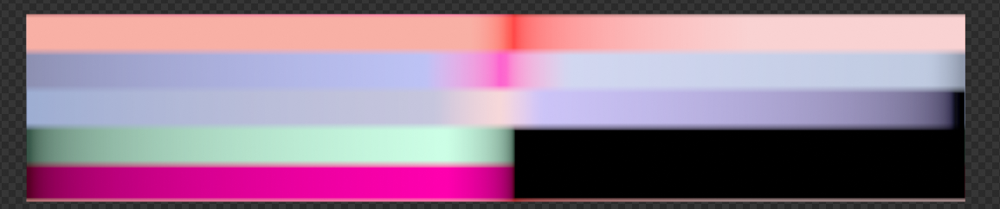
<figcaption><small>Ramp<small></figcaption>
</figure>

Ramp图,用来映射阴影颜色

用`NdotL`映射x轴,不同的`ID`映射y轴

这里的颜色和游戏里的不太一样,可能是额外改过的

这个案例里没有使用到

### SDF贴图

<div style="display: flex; justify-content: center; align-items: flex-start; gap:5px;">
  <figure style="text-align: center;">
    
  </figure>
  <figure style="text-align: center;">
    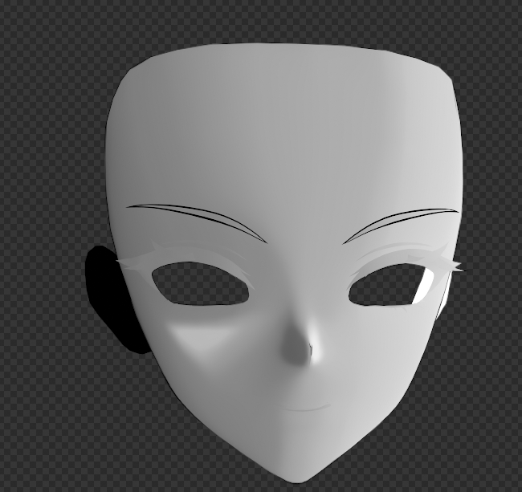
  </figure>
</div>

左侧为SDF的原始图像,鸣潮的SDF分在三个通道里存储,需要手动合成一下,将R,B,A三个通道相加取平均即可

$SDF=(T.R+T.B+T.A)/3$

G通道用途未知

### Eye贴图

<figure style="text-align: center;">
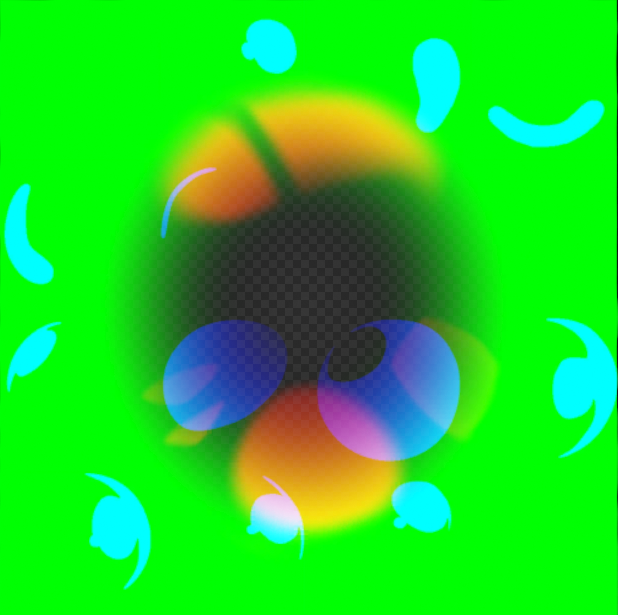
<figcaption><small>Eye贴图<small></figcaption>
</figure>

其中的R通道看着像高光,但是我加上去发现和游戏里的不一样,折腾了好久还是不知道怎么弄,只能作罢

案例里的高光是手动添加上去的

## UV

鸣潮的模型一共有四张UV,分别是:

- UV0: 用于映射贴图
- UV1: 使用八面体压缩的方式存储的平滑法线,用于描边(眼睛并不是)
- UV2: 和`UV0`是一样的
- UV3: 存储了静止姿态时的世界位置

<div style="display: flex; justify-content: center; align-items: flex-start; gap:5px;">
  <figure style="text-align: center;">
    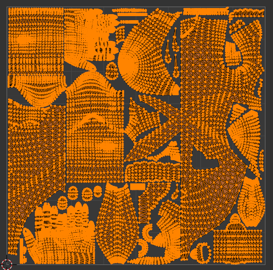
    <figcaption><small>UV0</small></figcaption>
  </figure>
  <figure style="text-align: center;">
    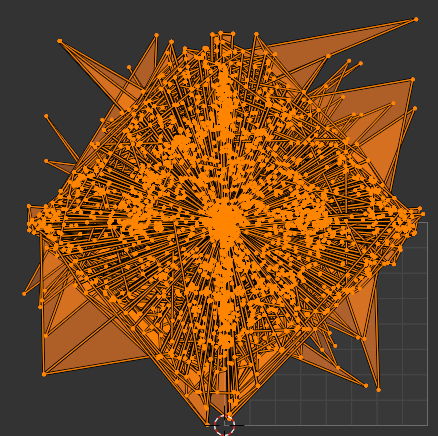
    <figcaption><small>UV1</small></figcaption>
  </figure>
</div>

<div style="display: flex; justify-content: center; align-items: flex-start; gap:5px;">
  <figure style="text-align: center;">
    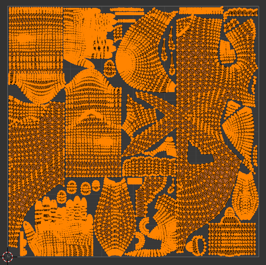
    <figcaption><small>UV2</small></figcaption>
  </figure>
  <figure style="text-align: center;">
    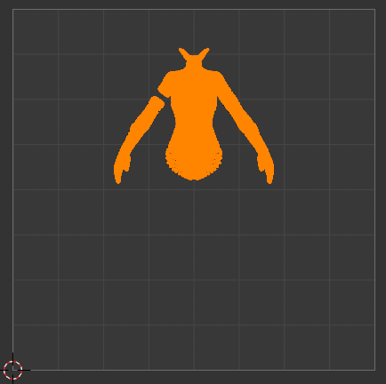
    <figcaption><small>UV3</small></figcaption>
  </figure>
</div>

<figure style="text-align: center;">
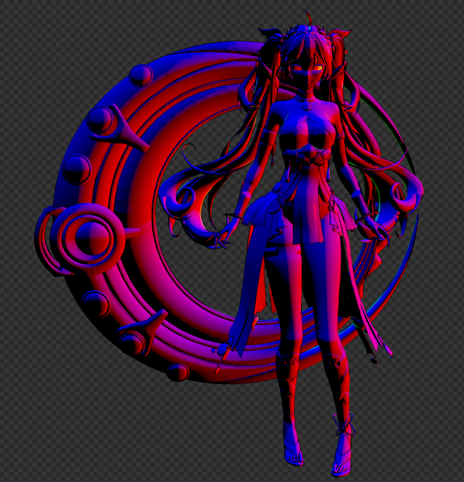
<figcaption><small>解码的平滑法线<small></figcaption>
</figure>


虽然我们使用Malt时不会用外扩法线的方式去做描边,也就用不到`UV1`,但是这里还是提一下怎么使用,毕竟做都做了

法线的压缩方式可以参考[文章](https://zhuanlan.zhihu.com/p/677238789)

```GLSL linenums="1"
vec3 Decode(vec2 f){
    f-=vec2(0.,1.);//移到原点
    vec3 n=vec3(f.x,f.y,1.-abs(f.x)-abs(f.y));
    float t=clamp(-n.z,0.,1.);
    n.x+=(n.x>=0.)?-t:t;
    n.y+=(n.y>=0.)?-t:t;
    return normalize(n);
    // return normalize(n)*0.5+0.5; // 0~1范围的法线贴图
}
```
这样就得到了平滑的法线矢量,将其变换到世界空间就可以在描边上使用了

## 顶点色

角色有一个顶点色,由于没有找到相关的讨论,不太清楚是干什么用的,感觉都和描边有关

<div style="display: flex; justify-content: center; align-items: flex-start; gap:5px;">
  <figure style="text-align: center;">
    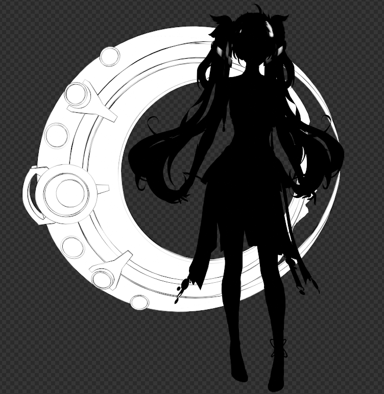
    <figcaption><small>R</small></figcaption>
  </figure>
  <figure style="text-align: center;">
    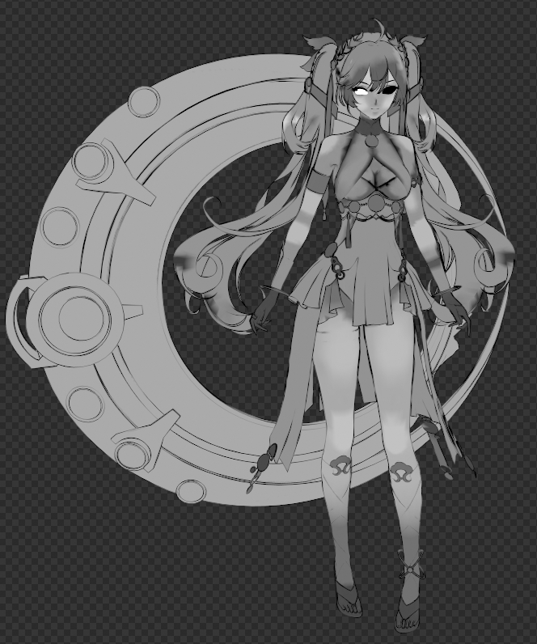
    <figcaption><small>G</small></figcaption>
  </figure>
</div>

<div style="display: flex; justify-content: center; align-items: flex-start; gap:5px;">
  <figure style="text-align: center;">
    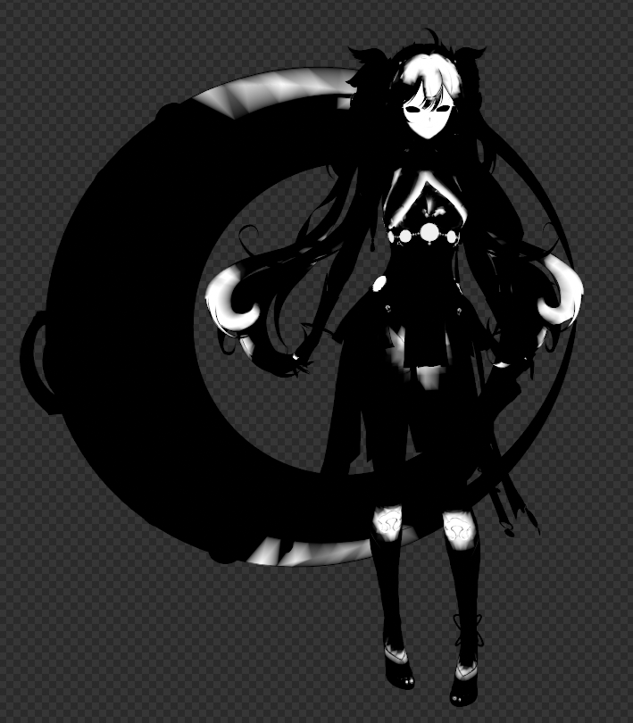
    <figcaption><small>B</small></figcaption>
  </figure>
  <figure style="text-align: center;">
    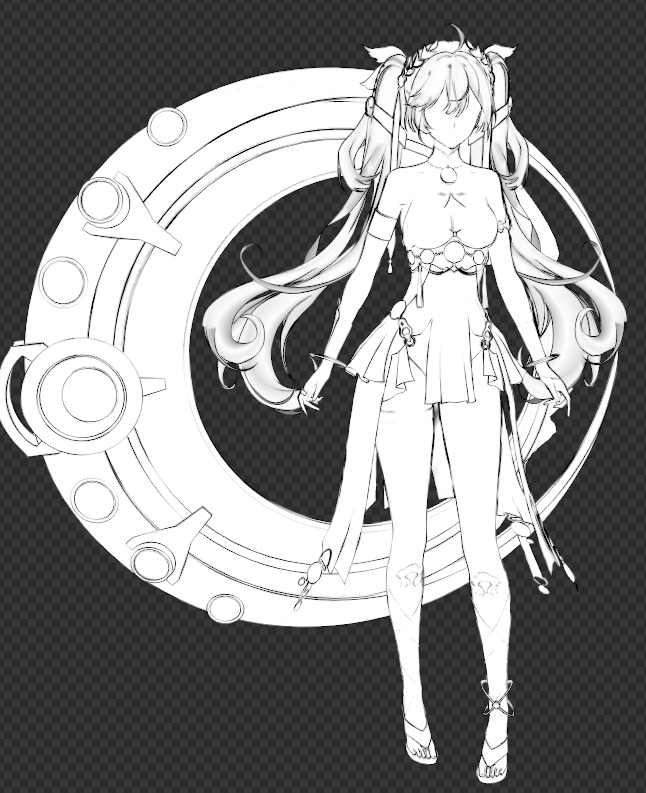
    <figcaption><small>A</small></figcaption>
  </figure>
</div>

## 创建阴影

### 法线转换

在创建阴影前先处理法线贴图,下面这个函数是补全法线贴图并添加缩放参数控制法线的强度

函数内容大概是:

- 将法线映射到[-1,1]
- 添加缩放参数
- 计算出z分量
- 再映射回[0,1]
- 将其他两个通道原样输出

```GLSL linenums="1"
//采样绿色法线
/*  META
@UV: label=UV; default=UV[0];
@scale: default=1.0;
*/
void Smapler_green_normal(in sampler2D tex, in vec2 UV,in float scale, out vec3 normal,out float tex_b,out float tex_a)
{
    vec4 tex_color = texture(tex, UV);
    vec2 xy=tex_color.rg*2.0-1.0;
    xy*=scale;
    normal = vec3(xy.x, xy.y, sqrt(1-clamp(dot(xy, xy),0.,1.)));
    normal = normal*0.5+0.5;
    tex_b = tex_color.b;
    tex_a = tex_color.a;
}
```

另外用到的一个工具函数是`HasImage`,用来判断是否有输入贴图,因为有些物体是没有法线贴图的
```GLSL linenums="1"
void HasImage(in sampler2D Image, out bool result)
{
    result = textureSize(Image, 0).x > 1;
}
```
<figure style="text-align: center;">
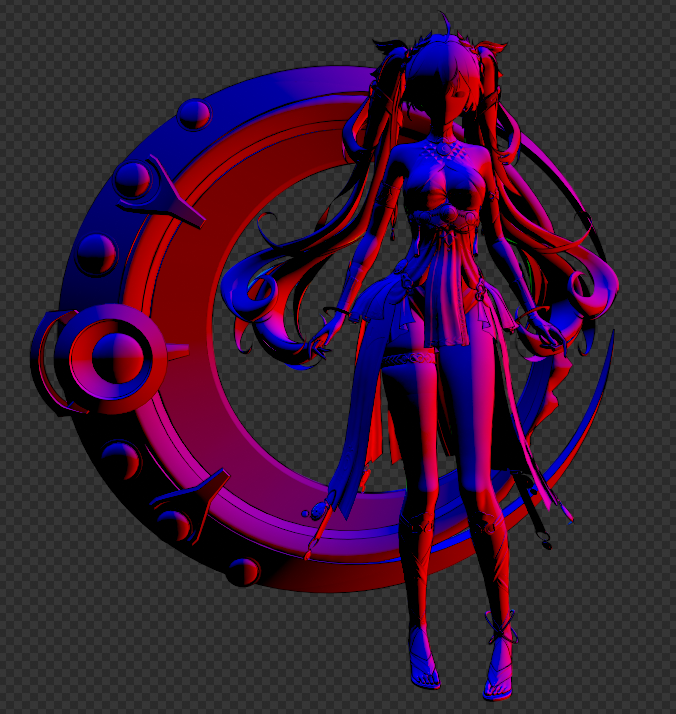
<figcaption><small>输出的法线<small></figcaption>
</figure>
<figure style="text-align: center;">
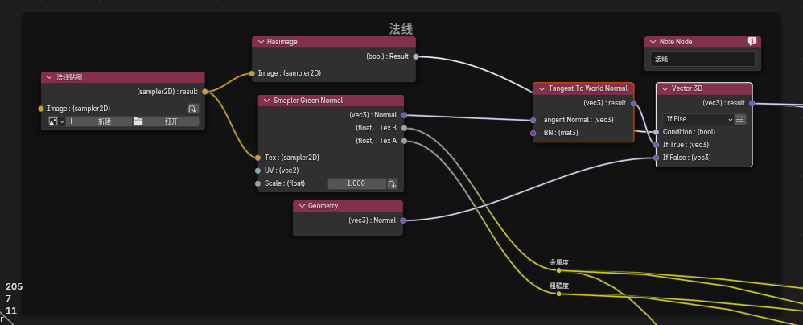
<figcaption><small>节点图<small></figcaption>
</figure>
使用内置的`Tangent To World Normal`节点,将切线空间的法线转为世界空间

使用`HasImage`判断有没有输入法线贴图,如果没有就使用默认的法线

### 二分阴影

<div style="display: flex; justify-content: center; align-items: flex-start; gap:5px;">
  <figure style="text-align: center;">
    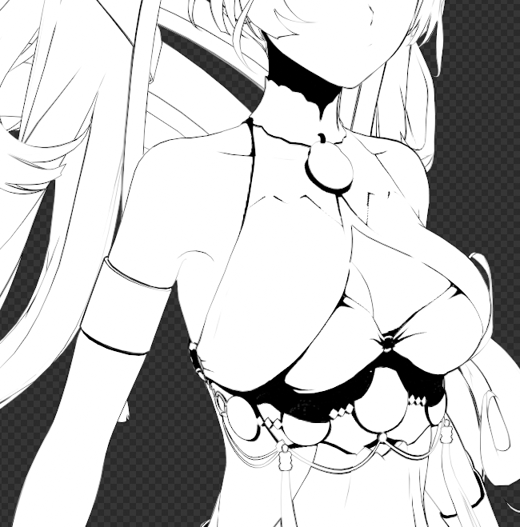
    <figcaption><small>固有阴影</small></figcaption>
  </figure>
  <figure style="text-align: center;">
    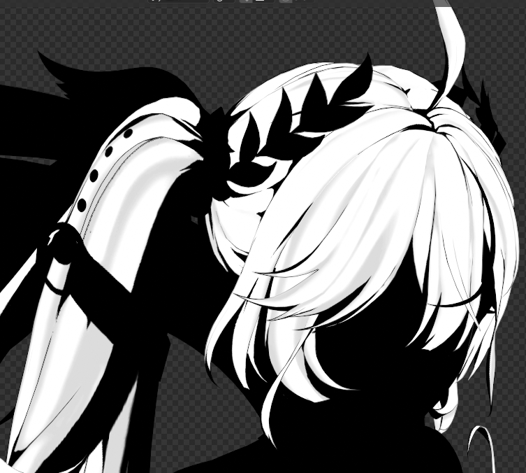
    <figcaption><small>头发阴影</small></figcaption>
  </figure>
</div>
<div style="display: flex; justify-content: center; align-items: flex-start; gap:5px;">
  <figure style="text-align: center;">
    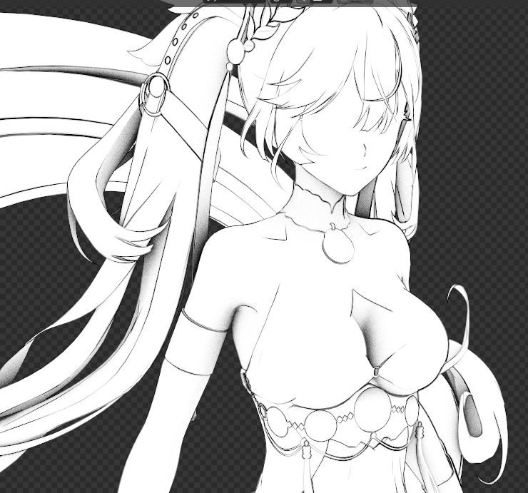
    <figcaption><small>AO</small></figcaption>
  </figure>
  <figure style="text-align: center;">
    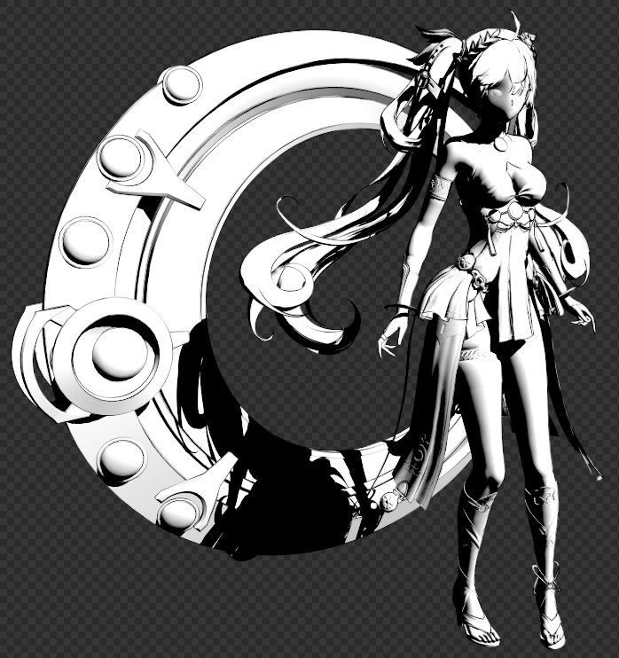
    <figcaption><small>光照阴影</small></figcaption>
  </figure>
</div>

- 使用`smoothstep`选出`_D贴图的Alpha通道`的阴影部分
- 使用`smoothstep`选出`_HM贴图的G通道`的阴影部分
- 使内置的`Ambient Occlusion`节点和`smoothstep`选取AO部分
- 使用`NPR Diffuse`内置着色器输出光照阴影

最后使用最小值`min`合并所有的阴影

对于透明物体的`Alpha通道`真的是透明,所以需要一个变量手动指定哪些部分是透明的

对于头发专有的贴图部分,也要用`HasImage`去混合一下

在`NPR Diffuse`中,使用一个参数控制`Gradient Size`可以控制阴影的软硬

#### 阴影偏移Shadow Offset

阴影偏移指的是用贴图控制二分的阈值,增加阴影交界处的细节

使用`smoothstep`调整`_HM贴图的G通道`,并连接到`NPR Diffuse`的`Offset`去控制阈值

<div style="display: flex; justify-content: center; align-items: flex-start; gap:5px;">
  <figure style="text-align: center;">
    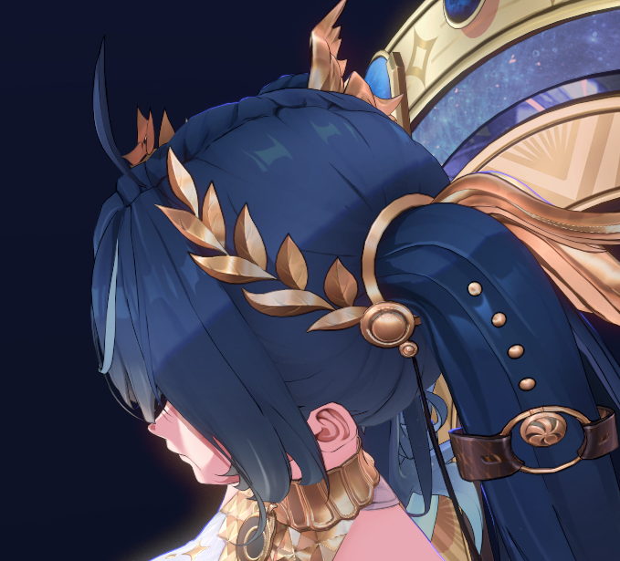
    <figcaption><small>阴影偏移关</small></figcaption>
  </figure>
  <figure style="text-align: center;">
    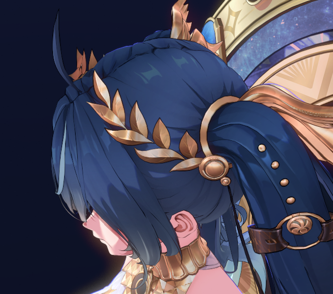
    <figcaption><small>阴影偏移开</small></figcaption>
  </figure>
</div>

<figure style="text-align: center;">
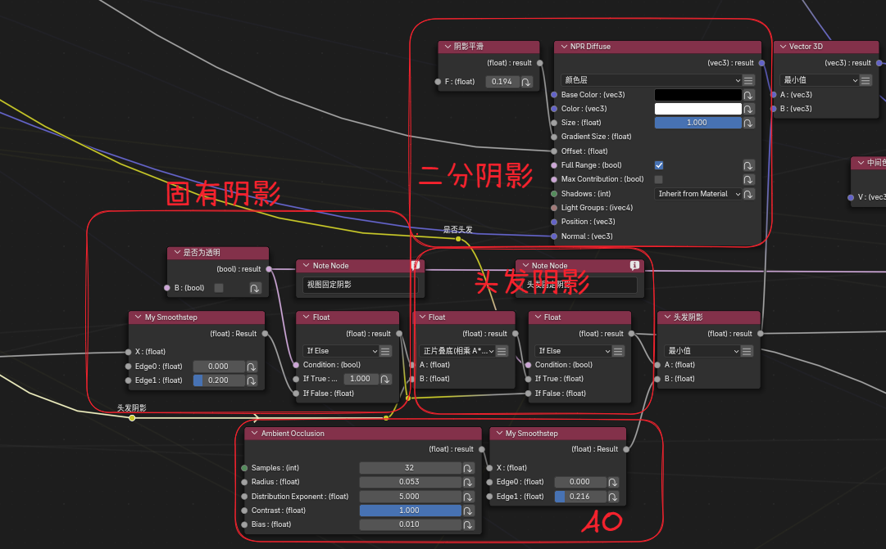
<figcaption><small>节点图<small></figcaption>
</figure>
<figure style="text-align: center;">
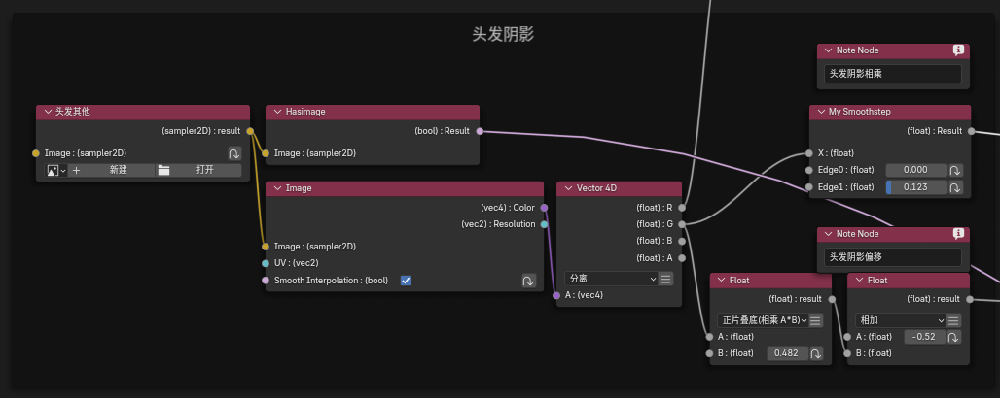
<figcaption><small>头发部分<small></figcaption>
</figure>
<figure style="text-align: center;">

<figcaption><small>阴影<small></figcaption>
</figure>
最后得到的应该是一个这样的黑白阴影

### 阴影着色

创建完黑白的阴影图之后,我们需要将阴影叠加到颜色贴图上

这里用一个函数给阴影映射上颜色,这里拆分成两段线性(1)的渐变三种颜色,是为了能给阴影的交界处单独着色
{ .annotate }

1. 你也可以换成其他的更平滑的映射

将阴影色和中间色暴露给材质,这样就能为每个材质指定不同的颜色

最后直接与颜色贴图相乘,就完成了阴影的添加

```GLSL linenums="1"
//三种颜色的渐变
/*  META
@position1: subtype=Slider;default=0.0;min=0.0;max=1.0;
@position2: subtype=Slider;default=0.5;min=0.0;max=1.0;
@position3: subtype=Slider;default=1.0;min=0.0;max=1.0;
@color1: default=(0.0, 0.0, 0.0);
@color2: default=(0.5, 0.5, 0.5);
@color3: default=(1.0, 1.0, 1.0);
*/
void ramp_3colors(in float x,in float position1,in vec3 color1,
    in float position2,in vec3 color2,
    in float position3,in vec3 color3,
out vec3 result)
{
    if (x <= position1) {
        result = color1;
    }
    else if (x >= position3) {
        result = color3;
    }
    else if (x <= position2) {
        // 在 [position1, position2] 区间进行 color1 → color2 插值
        float t = (x - position1) / (position2 - position1);
        result = mix(color1, color2, t);
    }
    else {
        // 在 [position2, position3] 区间进行 color2 → color3 插值
        float t = (x - position2) / (position3 - position2);
        result = mix(color2, color3, t);
    }
}
```
<figure style="text-align: center;">
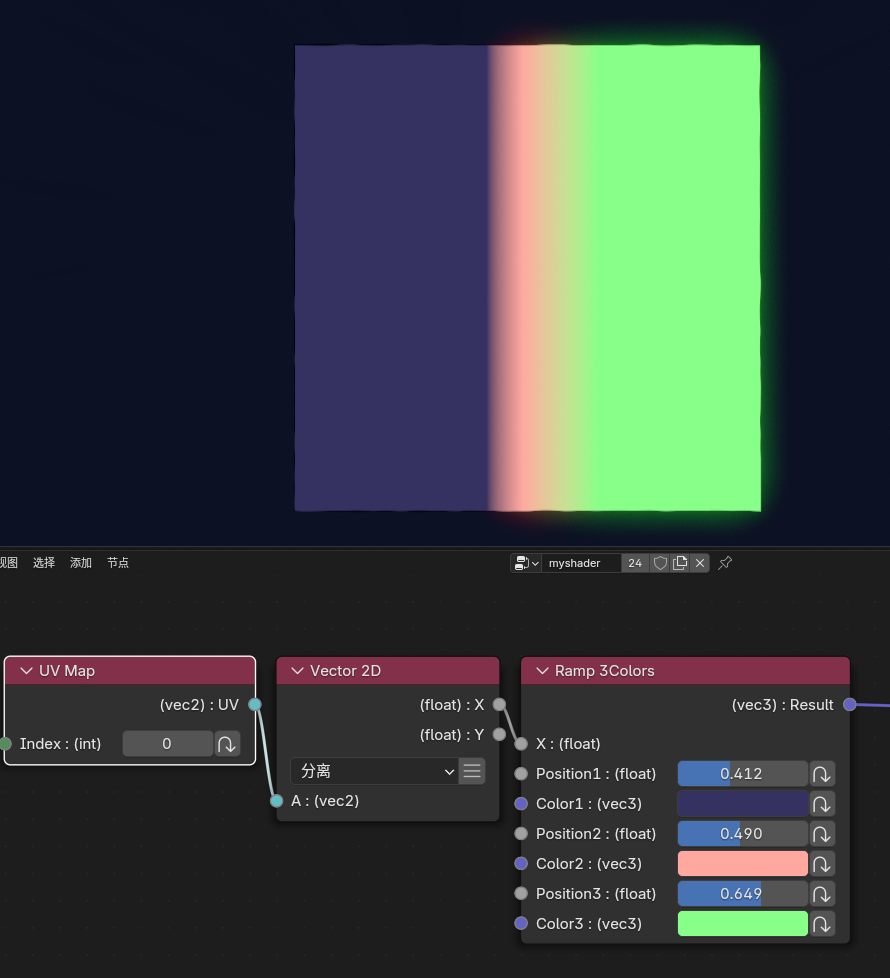
<figcaption><small>阴影<small></figcaption>
</figure>

<div style="display: flex; justify-content: center; align-items: flex-start; gap:5px;">
  <figure style="text-align: center;">
    
    <figcaption><small>阴影着色</small></figcaption>
  </figure>
  <figure style="text-align: center;">
    
    <figcaption><small>直接相乘</small></figcaption>
  </figure>
</div>

## SDF

对于脸部的这种比较重要的部位,如果直接使用默认的光影,那么脸部的阴影将会是非常杂乱切不连续的

尽管鸣潮的模型已经做了脸部的平面法线,但如果想更精细的控制脸部阴影还是需要使用SDF贴图

<div style="display: flex; justify-content: center; align-items: flex-end; gap: 10px; flex-wrap: nowrap;">
  <figure style="text-align: center; margin: 0;">
    
    <figcaption><small>不做任何修改的阴影</small></figcaption>
  </figure>
  <figure style="text-align: center; margin: 0;">
    
    <figcaption><small>平滑法线</small></figcaption>
  </figure>
  <figure style="text-align: center; margin: 0;">
    
    <figcaption><small>SDF</small></figcaption>
  </figure>
</div>

SDF是一张记录着各个角度时阴影分界线的阈值图

在日光和脸的夹角在不同的角度时取不同的阈值,用这个阈值对SDF图进行截取,就可以获得阴影边界了

当日光方向和面部方向相反时(正光夹角为180°),阈值为0,全为亮面

当日光方向和面部方向相同时(背光夹角为0°),阈值为1,全为暗面

所需的图大致如图A所示,圆圈表示不同角度的日光方向时的阈值

而我们输入的夹角将图B一样,需要将B图映射为A图

<div style="display: flex; justify-content: center; align-items: flex-start; gap:5px;">
  <figure style="text-align: center;">
    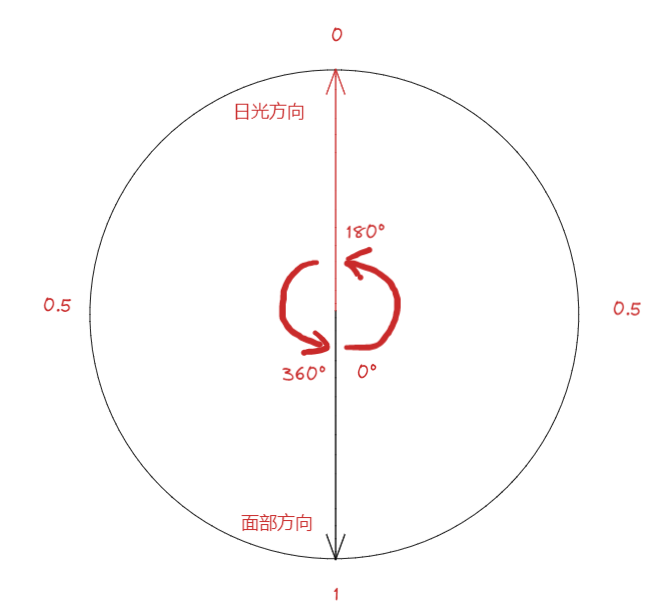
    <figcaption><small>A 需要的输出的值</small></figcaption>
  </figure>
  <figure style="text-align: center;">
    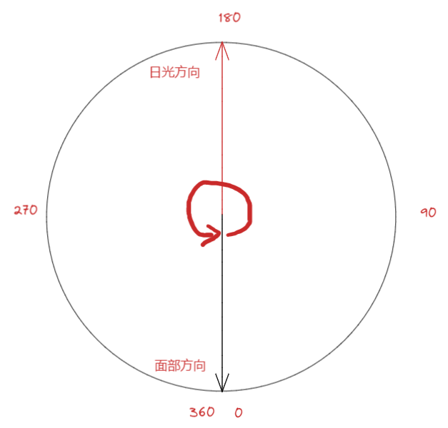
    <figcaption><small>B 角度的输入</small></figcaption>
  </figure>
</div>
<div style="display: flex; justify-content: center; align-items: flex-start; gap:5px;">
  <figure style="text-align: center;">
    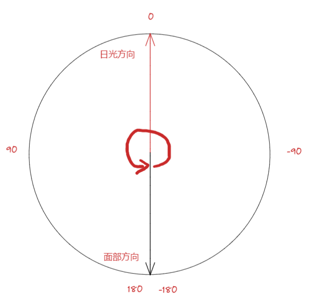
    <figcaption><small>C mod(angle, 2.0*PI)-PI</small></figcaption>
  </figure>
  <figure style="text-align: center;">
    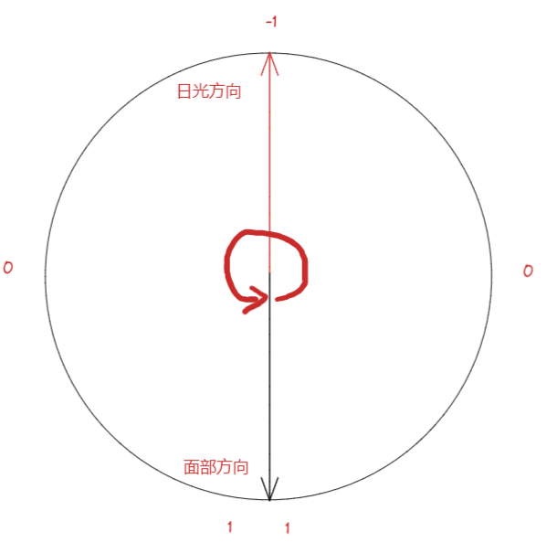
    <figcaption><small>D -cos(angle)</small></figcaption>
  </figure>
</div>

先取2π模,这是为了将较大的角度都映射到[0,2π],然后再-π

最后用cos就可以把角度映射到[-1,1]图D,再*0.5+0.5就可以映射到[0,1]我们需要的值了

SDF只记录了一侧光照的信息,左右两侧是对称的,需要根据光照方向进行切换

不能使用`dot`去获取两个矢量的夹角,因为`dot`获取不到夹角的正负值,这里用`arctan2`函数来获取夹角,这是具有正负值的

翻转uv,采样两张不同方向的SDF图,然后根据angle的正负值去选择需要哪一边的SDF

使用`smoothstep`根据阈值选出分界线,还可以加入`smoothness`参数控制交界的平滑度

用到的函数:

```GLSL linenums="1" title="SDF"
//输入日光方向和面部方向,输出一个SDF用的角度
void DirToSDFAngle(in vec3 face_dir,in vec3 sun_dir,out float angle)
{
    face_dir = normalize(face_dir*vec3(1,1,0));//转换为水平平面的矢量
    sun_dir = normalize(sun_dir*vec3(1,1,0));//转换为水平平面的矢量
    float face_angle = atan(face_dir.y, face_dir.x);
    float sun_angle = atan(sun_dir.y, sun_dir.x);
    sun_angle = mod(sun_angle-PI/2.0, 2.0*PI);
    face_angle = mod(face_angle+PI/2.0, 2.0*PI)-PI;
    angle= sun_angle-face_angle;
}


//输入一个角度和SDF图,输出一个二分阴影的mask

/*  META
@UV: label=UV; default=UV[0];
@smoothness: subtype=Slider;default=0.02;min=0.0;max=1.0;
*/
void toon_sdf_mask(in sampler2D SDF, in vec2 UV,in float angle,in float smoothness,in float offset, out float mask,out float SDF_R,out float SDF_G,out float SDF_B,out float SDF_A)
{
    vec4 SDF_RIGHT = texture(SDF, UV);
    float SDF_R_F =( SDF_RIGHT.r+SDF_RIGHT.b+SDF_RIGHT.a)/3.0+offset;
    vec4 SDF_LEFT = texture(SDF, vec2(1.0-UV.x, UV.y));
    float SDF_L_F =(SDF_LEFT.r+SDF_LEFT.b+SDF_LEFT.a)/3.0+offset;
    angle =mod(angle, 2.0*PI)-PI;
    float Threshold = -cos(angle)*0.5+0.5;
    if (angle>0.0)
    {
        mask = smoothstep(Threshold-smoothness,Threshold+smoothness,SDF_R_F);
    }
    else
    {
        mask = smoothstep(Threshold-smoothness,Threshold+smoothness,SDF_L_F);
    }
    SDF_R = SDF_RIGHT.r;
    SDF_G = SDF_RIGHT.g;
    SDF_B = SDF_RIGHT.b;
    SDF_A = SDF_RIGHT.a;
}
```

<figure style="text-align: center;">
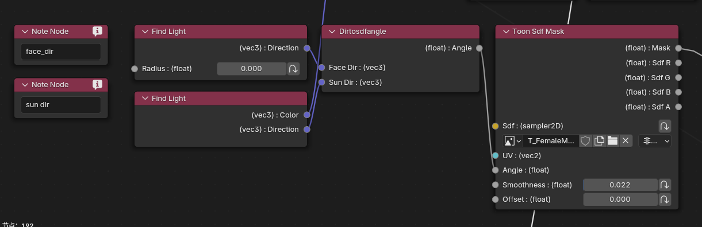
<figcaption><small>节点图<small></figcaption>
</figure>

将输出的mask与之前的阴影取最小值即可

### 如何传递数据到Shader内

那么问题来了.怎么将面部方向和日光方向传入Shader中去
#### 驱动器

一个简单的方法是使用驱动器,将日光的旋转复制驱动器到矢量旋转里,这样就可以获得方向

但是这样不够优雅(bushi)

<figure style="text-align: center;">
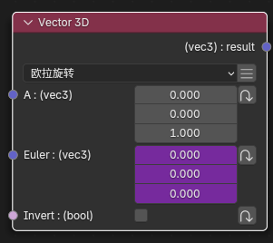
<figcaption><small>使用驱动器<small></figcaption>
</figure>

接下来介绍一种奇技淫巧的方法将数据传入shader中

#### 灯光传递

Shader中是可以读取到灯光的,所有的灯光都会在一个灯光数组内,我们只需要在shader中找到绑定在脸上的灯光,然后读取它的方向,日光也是一样的

所有的灯光都在`LIGHTS.lights`数组里,每个项都是一个结构体,结构体里存储了灯光的各种信息,需要设置一些过滤条件,就可以找到需要的灯光

下面这个函数会根据条件是否相等过滤灯光,如果输入为0,则不启用这个条件

因为`LIGHTS.lights`只在`MESH_SHADER`有效,所以加了宏定义防止报错

节点组还用日光的亮度去混合SDF的强度,如果日光亮度为0,就不使用SDF了

<figure style="text-align: center;">
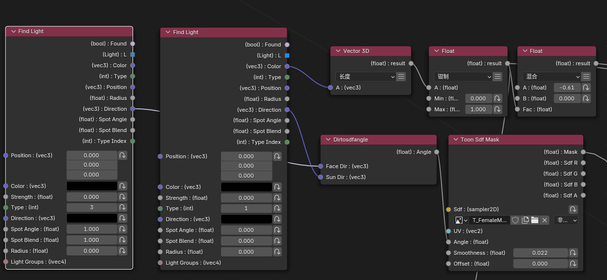
<figcaption><small>节点图<small></figcaption>
</figure>

<figure style="text-align: center;">
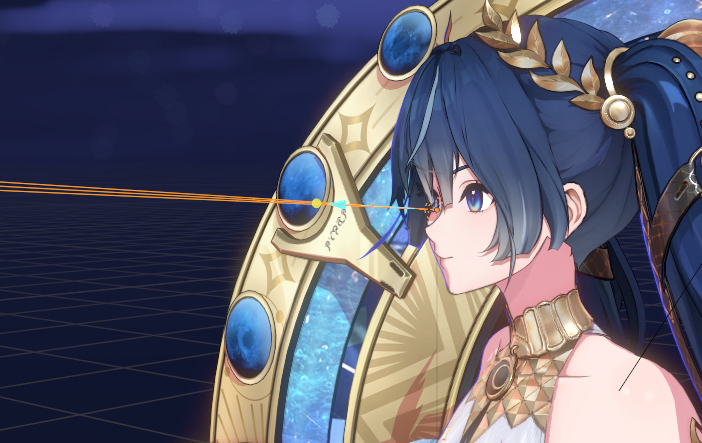
<figcaption><small>将一个聚光绑定到脸上<small></figcaption>
</figure>

```GLSL linenums="1" title="find_light"
#if defined(IS_MESH_SHADER) || defined(IS_SCREEN_SHADER)
#ifdef IS_MESH_SHADER
/*  META
@position: subtype=Vector; default=(0.0,0.0,0.0);
@color: default=(0.0,0.0,0.0);
@strength: default=0.0;
@type: default=0;
@direction: default=(0.0,0.0,0.0);
@spot_angle: default=0.0;
@spot_blend: default=0.0;
@light_groups: default=MATERIAL_LIGHT_GROUPS;
*/
#else
/*  META
@position: subtype=Vector; default=(0.0,0.0,0.0);
@color: default=(0.0,0.0,0.0);
@strength: default=0.0;
@type: default=0;
@direction: default=(0.0,0.0,0.0);
@spot_angle: default=0.0;
@spot_blend: default=0.0;
@light_groups: default=ivec4(1,0,0,0);
*/
#endif
void find_light(
    in vec3 position,
    in vec3 color,
    in float Strength,
    in int type,
    in vec3 direction,
    in float spot_angle,
    in float spot_blend,
    in float radius,
    in ivec4 light_groups,
    out bool found,          // 是否找到
    out Light L              // 找到的灯光
    // *灯光过滤函数，根据灯光属性进行过滤，返回找到的第一个满足条件的灯光
)
{
    L.position     = vec3(0.0);
    L.direction    = vec3(0.0, 0.0, -1.0);
    L.color  = vec3(0.0);
    L.type         = 0;
    L.spot_angle   = 0.0;
    L.spot_blend   = 0.0;
    found = false;
    spot_angle = radians(spot_angle);
    spot_blend = radians(spot_blend);
    for (int i = 0; i < LIGHTS.lights_count; i++)
    {
        Light L_temp = LIGHTS.lights[i];
        // 灯光分组匹配
        bool group_match = false;
        for(int g = 0; g < 4; g++)
        {
            if(light_groups[g] == 0 || LIGHT_GROUP_INDEX(i) == light_groups[g])
            {
                group_match = true;
                break;
            }
        }
        if(!group_match) continue;
        //判断条件
        // 位置判断
        if(length(position) > 0.0 && distance(L_temp.position, position) > 0.001) continue;
        
        // 颜色判断
        if(length(color) > 0.0 && distance(L_temp.color, color) > 0.001) continue;
        
        float light_strength = max(max(L_temp.color.r, L_temp.color.g), L_temp.color.b);
        // 强度判断
        if(Strength != 0 && light_strength != Strength) continue;
        
        // 类型判断 1:日光 2:点光 3:聚光
        if(type != 0 && L_temp.type != type) continue;
        
        // 方向判断
        if(length(direction) > 0.0 && distance(L_temp.direction, direction) > 0.001) continue;
        
        // 聚光角度判断
        if(spot_angle > 0.0 && abs(L_temp.spot_angle - spot_angle) > 0.001) continue;
        
        // 聚光混合判断
        if(spot_blend > 0.0 && abs(L_temp.spot_blend - spot_blend) > 0.001) continue;
        
        // 半径判断
        
        if(radius > 0.0 && distance(position, L_temp.position) > radius) continue;
        // 找到第一个满足条件的灯光
        L = L_temp;
        L.direction=-L.direction;
        found = true;
        break;
    }
    
}
#endif
```

## 刘海投影

<figure style="text-align: center;">

<figcaption><small>效果图<small></figcaption>
</figure>

刘海投影留到下章再讲,就是获取刘海蒙版然后往下偏移