# Blender Malt NPR 渲染指南 

<video src="https://www.pragma37.com/docs/rtc2021/renato3xl.mp4" 
autoplay
loop
muted
playsinline style="display: block; margin: 0 auto; width: 100%; border-radius: 40px; pointer-events: none;">
</video>
<figcaption style="text-align: center;"><small>官方示例<small></figcaption>
##简介
本文章以我的学习记录分享为主,希望能抛砖引玉吸引到更多的大佬使用这个渲染器，制作出更优秀的作品

这里以鸣潮的尤诺作为示例，跟完所有教程应该可以获得这样的一个渲染效果
<figure style="text-align: center;">
  
  <figcaption><small>最后的效果<small></figcaption>
</figure>

### 渲染器介绍
Malt(麦芽)是一个**完全可定制**的免费开源引擎，主要针对NPR渲染而开发

麦芽由Miguel Pozo在2021年6月进行开发，历经大半年时间完成,在[这里](https://bnpr.gumroad.com/)可以看到一些使用Malt的作品
> Miguel Pozo也是现在blenderNPR分支的主要开发人员

渲染器现在处于维护状态，也就是仅对最新版本进行适配，不再添加新的功能，经过测试最新的**blender4.5版本**以及**之前的版本**应该都是支持的

渲染器的更多信息在[官方文档](#官方文档)中已经写的比较详细了，我就不过多赘述了

## Malt渲染器的优劣 
**使用Malt的优势：**  

- 实时渲染<small>(材质里不做太多骚操作的情况下)</small>
- 内置风格化NPR着色器模型，快速创建风格化材质

<figure style="text-align: center;">
  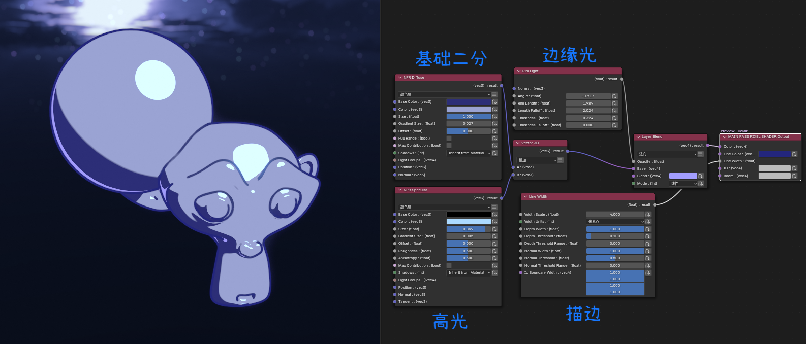
  <figcaption><small>快速创建着色器<small></figcaption>
</figure>

- 高质量的阴影<small>(只有硬阴影，软阴影社区中中有实现的例子)<small>
- 灯光排除
- 相对优秀的内置描边<small>(ID边缘检测,深度检测,法线检测混合的描边)<small>

<figure style="text-align: center;">
  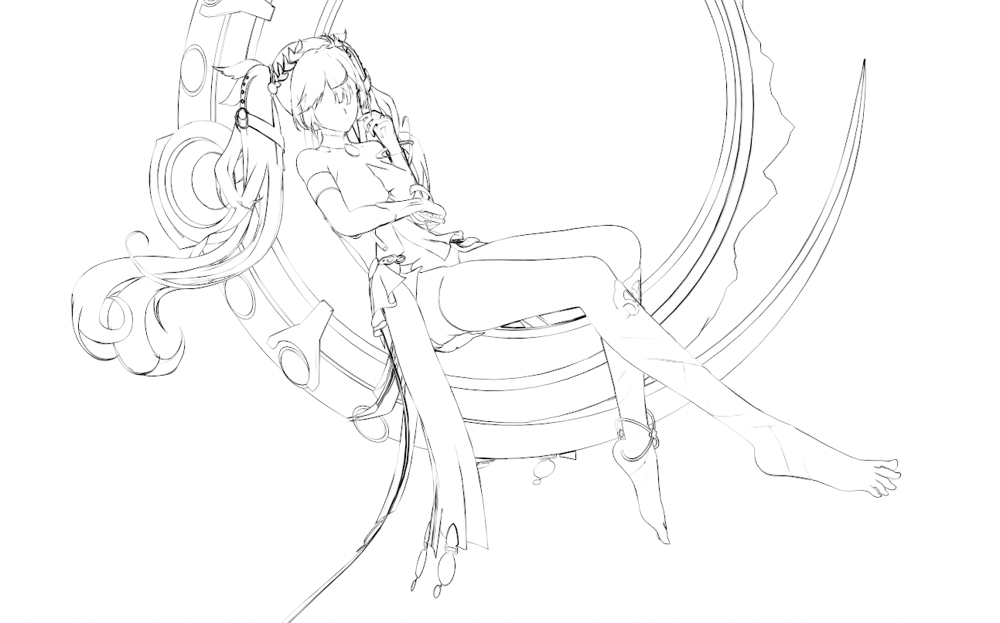
  <figcaption><small>内置描边效果<small></figcaption>
</figure>
- 由GLSL自动生成着色器节点<small>(可以从现有的着色器代码里直接开抄)<small>

- 可自定义的渲染管线<small>(使用python创建自定义的渲染管线)<small>
- 完全开放的Opengl<small>(理论上Opengl能做到的，这里都可以做到)<small>

**使用Malt的缺点：**

- 较为稀缺的学习资料，能找的有关渲染器的所有资料都在[这](#相关资源)了
- 偶尔不知所以的报错和bug,虽然大多数没有影响
- 和光线追踪相关的一切东西都不存在<small>(内置SSAO,屏幕空间反射社区中有实现的例子)<small>
- 比较慢的GLSL生成节点的速度<small>(大概3s作用)<small>
- blender内置的合成器支持有限，几乎所有的后期效果都要手搓<small>(例如辉光,景深，散景等后期效果)<small>

## 快速开始

### 安装

[下载](https://github.com/bnpr/Malt/releases/tag/Release-latest)压缩包，和正常的blender插件一样的安装方式即可

[官方教程](https://malt3d.com/Documentation/Getting%20Started/)

!!! note ""
    还有一个节点组分支版本，可以创建节点组，其他和主要版本没有区别，推荐用[这个](https://github.com/bnpr/Malt/releases/tag/node-groups-latest)

<figure style="text-align: center;">
  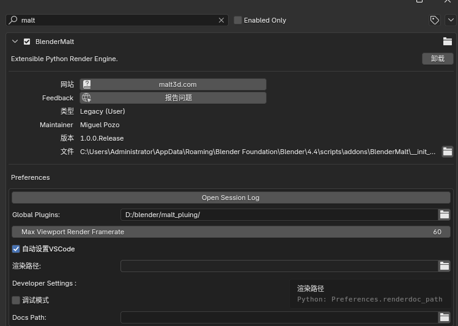
</figure>

!!! note ""
    - **Global Plugins** ：Malt的插件文件夹<small>(Malt本身有自己的插件系统)<small>
    - **Max Viewport Render Framerate** ：最大视图帧率给到60就行了

### 开始渲染!!!
- 渲染器切换到Malt
    <figure style="text-align: center;">
    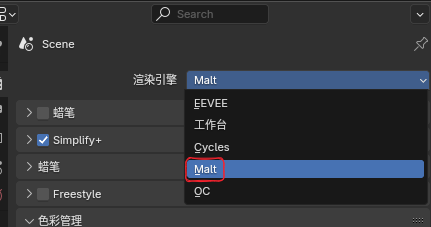
    </figure>
!!! note ""
    切换的时候会自动打开一个opengl的小窗口，只是为了保证渲染速度，不用管

- 创建一个**模型**和一个**日光**，为其添加材质和创建着色器
    <figure style="text-align: center;">
    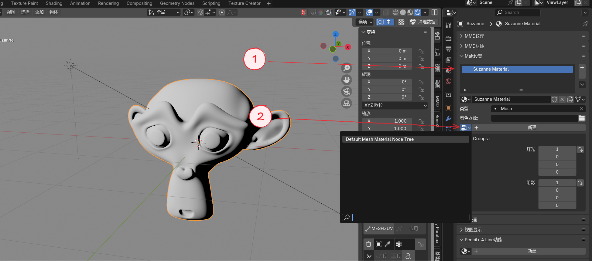
    </figure>
!!! note ""
    - 如果你不知道怎么创建模型和灯光，那么应该去看看Blender[入门](https://www.bilibili.com/video/BV14u41147YH/?spm_id_from=333.1007.top_right_bar_window_history.content.click)
    - Malt中材质与着色器是**分离**的，一个着色器可以被多个材质使用
    - **Mlat不支持面光,只支持日光，聚光，点光**

- 切换到Malt的着色器编辑器面板
    <figure style="text-align: center;">
    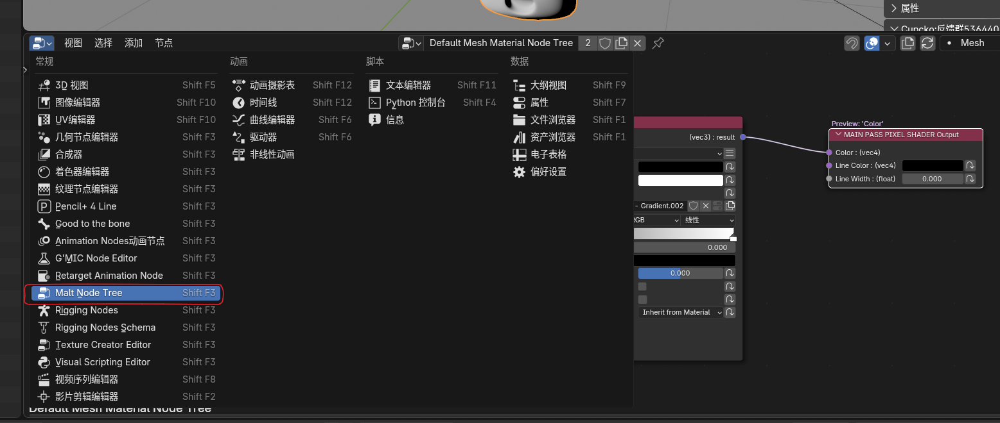
    <figcaption><small>只有切换到Malt渲染器才会有这个面板<small></figcaption>
    </figure>

- 添加组合内置的着色器节点，随便调整一下参数
    <figure style="text-align: center;">
    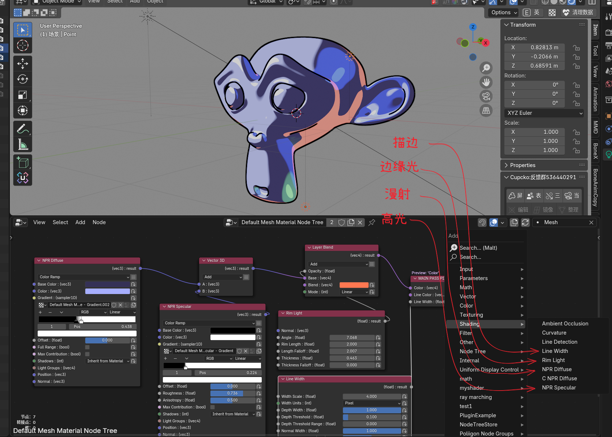
    <figcaption><small>基础卡通材质<small></figcaption>
    </figure>
!!! note ""
    - 内置的着色器模型在Shader下
    - 使用**相加**<small>(在Math-Vector3D里)</small>和**颜色混合**<small>(在Color-Layer Blend)</small>组合着色器
    - 将**Line Width节点**连接到**输出的Line Width**即可创建描边
    - 这里额外添加了几个点光，可以看到内置的着色器是默认支持多光源的
    - 纯**黄色**是Malt里的**着色器错误**的颜色，类似blender或unity里的紫红色，刚创建着色器可以会变黄，随便找个节点连上就好了
    - Malt内置了预览节点的快捷键,按**Ctrl+Shift+鼠标左键**点击节点即可**快速预览**

- 调整背景颜色
    <figure style="text-align: center;">
    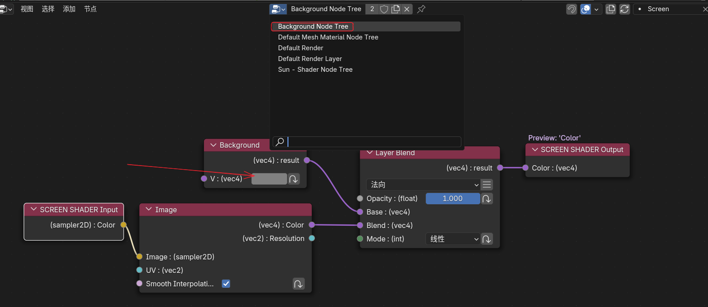
    </figure>
    切换到`Background Node Tree`节点树

    在这里去调整背景颜色，也可以添加一个HDR贴图之类的

## 其他设置

- 渲染器设置
    <figure style="text-align: center;">
    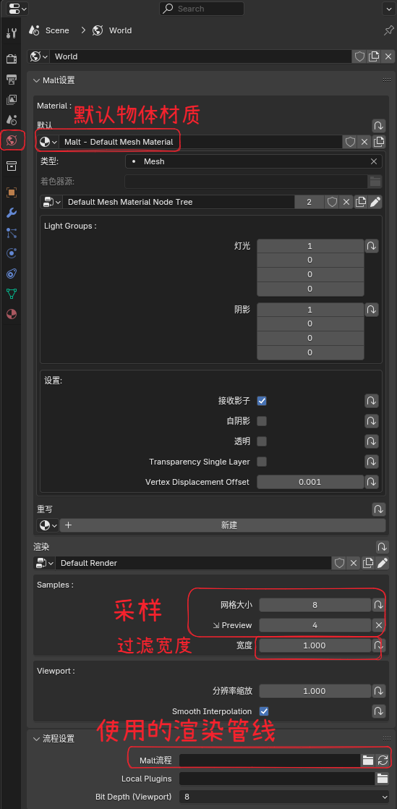
    </figure>

    在世界环境选项卡中可以调整一些渲染器的设置
    - 可以设置没有材质时物体使用的材质
    - Samples->网格大小:渲染器采样 
    - Samples->宽度:抗锯齿过滤的宽度，设置成0就是保留像素的效果 

    渲染流程:可以选择使用的渲染管线
    !!! note ""
        除了默认的渲染管线，Malt内还内置了一个最小渲染管线Mini Pipeline可以选择使用

        在`插件目录:addons\BlenderMalt\.MaltPath\Malt\Pipelines\MiniPipeline`

        **渲染管线右边的刷新按钮可以重启渲染器,非常有用**

- 渲染信息
    <figure style="text-align: center;">
    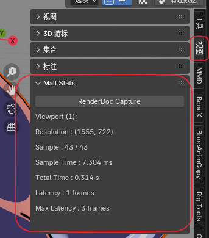
    </figure>
    在**N面板**的**视图选项卡**里可以看到**渲染信息**

- 物体渲染设置
    <figure style="text-align: center;">
    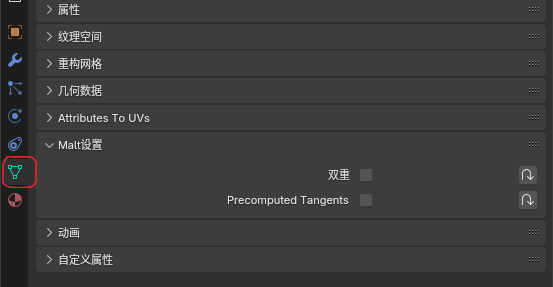
    </figure>
    在网格属性里可以设置**双面渲染**和是否**预计算切线**

- 材质设置
    <figure style="text-align: center;">
    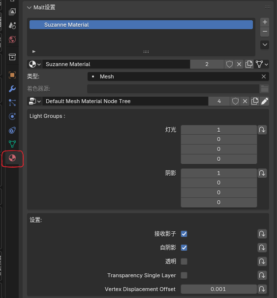
    </figure>
    大部分看名字应该就知道是啥意思了

    材质只受**相同灯光组**的**灯光**的影响

    <0,0,0>是背景使用的组，一般不要设置成一样的
## 相关资源 {#相关资源}
- [Malt 官方文档](https://malt3d.com/){#官方文档}
- [Malt GitHub仓库](https://github.com/bnpr/Malt)   
- [示例材质](https://github.com/bnpr/Malt/discussions/94)
- [B站教程](https://www.bilibili.com/video/BV1sd4y1477T/?spm_id_from=333.337.search-card.all.click&vd_source=595aeb226156d1c36fb30d91df5fb837)
- [讨论区](https://github.com/bnpr/Malt/discussions)    
- [BNPR](https://blendernpr.org/)   
- [Discord](https://discord.gg/bnpr-335479185197891585) 