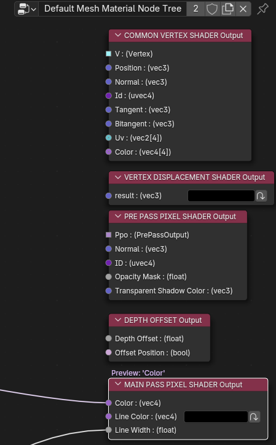

# 渲染管线,节点树类型

## 节点树类型

<figure style="text-align: center;">

</figure>
Malt一共有5种节点树类型，分别是

### **渲染管线**
<figure style="text-align: center;">

<figcaption><small>渲染管线<small></figcaption>
</figure>

渲染大概流程:

场景数据输入 -> 渲染层中进行渲染，输出渲染完成的图片 -> 屏幕的处理着色器进行后处理 -> 抗锯齿 -> 输出

可以看到渲染流水线的是非常清晰的，这里还可以加入其他的节点，比如添加多个渲染层进行多次渲染，添加多个屏幕Pass进行多次处理等等

!!! note ""
    - 场景灯光设置中可以调整**阴影贴图**的尺寸，越大阴影越清醒
    - 渲染层中可以调整最大渲染的**透明层数**
    - **preview**表示**视图预览**中的值，上面的表示**实际渲染**使用的值
    - 渲染层中输出的一个透明的图像，灰色背景是在**屏幕Pass**里合成上去的
    - **SceneFilter**节点可以过滤掉场景数据里的集合，这样输入到渲染层里过滤的集合就没了

### **渲染层**

<figure style="text-align: center;">

<figcaption><small>渲染层<small></figcaption>
</figure>
渲染层决定了每个物体是怎么渲染的,可以看到现在的渲染顺序：

场景数据输入 -> Pre Pass -> 线条渲染 -> 输出

可以在**渲染管线**中选择使用的**渲染层**

### **网格**

<figure style="text-align: center;">

<figcaption><small>网格类型<small></figcaption>
</figure>

网格类型的节点树就是主要写**Shader**的地方

这里决定了**Pre Pas**和**Main Pass**的内容,以及一些其他的数据输出,图中的输出从上到下是:

- 顶点数据输出
- 顶点着色器输出
- Pre Pass输出
- 深度偏移输出
- Main Pass输出

### **屏幕**

<figure style="text-align: center;">

<figcaption><small>屏幕<small></figcaption>
</figure>

屏幕节点树就是**后处理**的地方，输入一张图像进行处理后输出:

默认的节点树在物体渲染完成后，透明的地方混合一个背景色,然后输出

可以在**渲染管线**中选择使用的**屏幕节点树**

### **灯光**

<figure style="text-align: center;">

<figcaption><small>灯光<small></figcaption>
</figure>

灯光节点树可以对灯光进行处理，定义灯光的颜色，衰减等信息

这个基本没过到不太熟，等用到了再补充

!!! note ""
    - **网格，屏幕，灯光**节点树都要依赖材质，其实就是一个**Shader**

## 总流程
<figure style="text-align: center;">

<figcaption><small>大致的渲染流程<small></figcaption>
</figure>

<figure style="text-align: center;">

<figcaption><small>官方详细版的<small></figcaption>
</figure>
